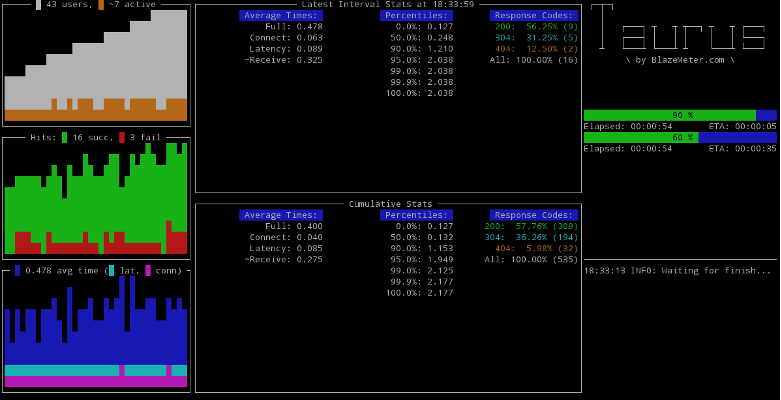

# Codename: Taurus

<i><b>T</b>est <b>au</b>tomation <b>ru</b>nning <b>s</b>moothly

## Purpose
A tool to hide the complexity of tests under automation-friendly convenience wrapper. More info about its features available [here](docs/Features.md).




## Installation or Upgrade

Just install it using PyPi:

```bash
pip install bzt
```

More detailed instructions for Linux, Mac OS and Windows available [here](docs/Installation.md).

## Getting Started

Create a file named `test.yml` with following contents:

```yaml
---
execution:
  concurrency: 10
  ramp-up: 1m
  hold-for: 1m30s

  scenario:
    think-time: 0.75
    requests:
      - http://blazedemo.com/
      - http://blazedemo.com/vacation.html
```

Then run `bzt test.yml`. After the tool finishes,
observe resulting summary stats in console log (more reporting options [here](docs/Reporting.md)). All artifact files from the run
will be placed in the directory mentioned in console log. Read more on command-line tool usage [here](docs/CommandLine.md).


## Further Reading

[Taurus Documentation](docs/Home.md)

[Support Forum](https://groups.google.com/forum/#!forum/codename-taurus)
