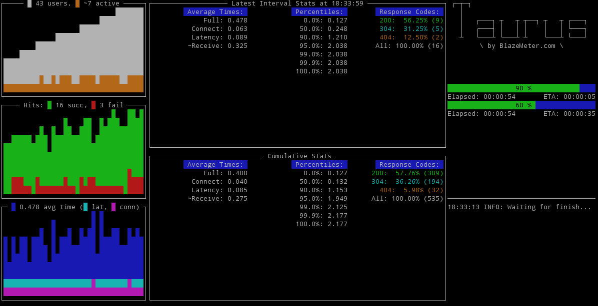
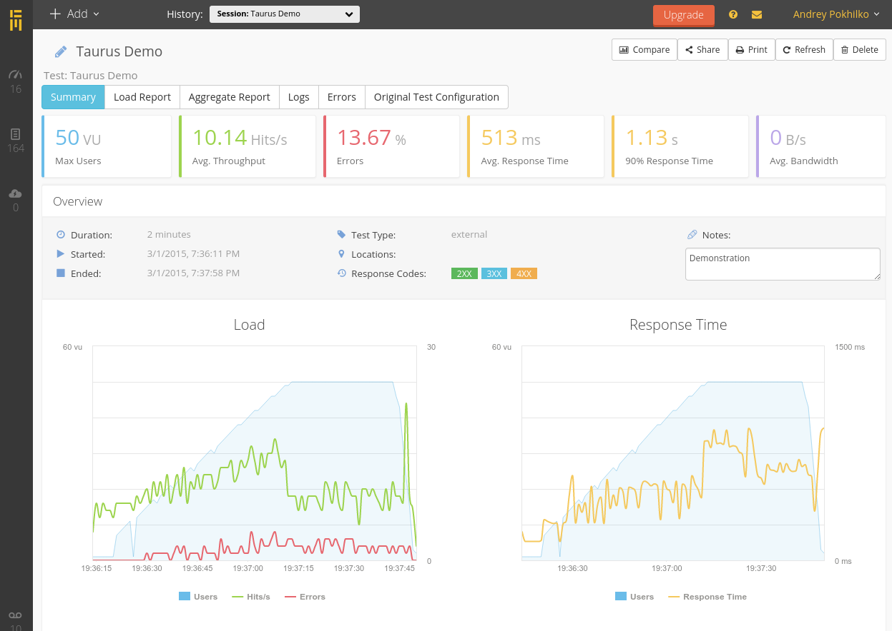
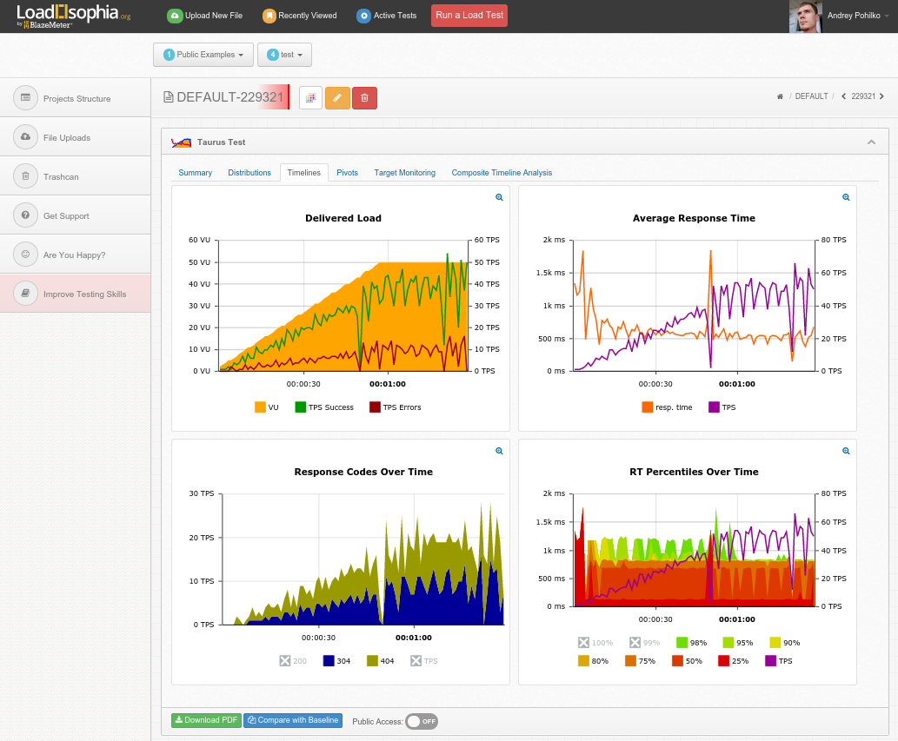

# Reporting & Results Processing

Reporting functionality in Taurus is delegated to special modules category. There is special [internal facility](#results-reading-and-aggregating-facility) that reads results from [executors](ExecutionSettings.md), aggregates them and feeds to configured reporters. Reporters are specified as list under top-level config key `reporting`, by default it is configured with two reporters:

```yaml
---
reporting:
    - final_stats
    - console
```

The example above uses a shorthand form for specifying reporters. Full form is using dictionaries and allows specifying some additional settings for reporters:

```yaml
---
reporting:
    - module: final_stats
    - module: console
```

Possible reporting modules are listed below.

## Post-Test Summary

This is the simpliest reporter that just prints few basic KPIs in the console log after test execution, for example:
```
18:04:24 INFO: Samples count: 367, 8.17% failures
18:04:24 INFO: Average times: total 0.385, latency 0.115, connect 0.000
18:04:24 INFO: Percentile   0.0%: 0.125
18:04:24 INFO: Percentile  50.0%: 0.130
18:04:24 INFO: Percentile  90.0%: 1.168
18:04:24 INFO: Percentile  95.0%: 1.946
18:04:24 INFO: Percentile  99.0%: 2.131
18:04:24 INFO: Percentile  99.9%: 3.641
18:04:24 INFO: Percentile 100.0%: 3.641
```

This reporter is enabled by default. To enable it manually, use following config:

```yaml
---
reporting:
    - final_stats
```

## Console Screen

This reporter shows fullscreen dashboard with some KPIs and even ASCII-art graphs like this:



This reporter is enabled by default. To enable it manually, use following config:

```yaml
---
reporting:
    - console
```

There is module settings for Console Screen, containing option `disable`. It allows easy disabling fullscreen display by using [command-line](CommandLine.md) switch `-o`:

```bash
bzt config.yml -o modules.consoled.disable=true
```

Two additional options are `dummy-cols` and `dummy-rows`, they affect the size of _dummy_ screen that is used for non-tty output (and on Windows platform).

## Pass/Fail Criterias

Every execution has pass/fail status and there is a way to set this status based on runtime criteria. Special `fail-criteria` reporter offers this functionality. Another useful feature of pass/fail criterias is _auto-stop_ functionality, allowing to interrupt failed tests automatically, sparing the time and resources.

Pass/fail criterias are specified as array of `criterias`, set through `reporting` item in config:

```yaml
---
reporting:
 - module: fail-criteria
  criterias:
  - subject: avg-rt  # required
    label: 'Sample Label'  # optional, default is ''
    condition: '>'  # required
    threshold: 150ms  # required
    timeframe: 10s  # optional, default is none
    fail: true  # optional, default is true
    stop: true  # optional, default is true
```

The above example shows full form of the criteria just how Taurus interprets it. However, there is more easy-to-read shorthand form that would look like:

```yaml
---
reporting:
 - module: fail-criteria
   criterias:
   - avg-rt of Sample Label>150ms for 10s, stop as failed
```

The short form has general format of `subject of label{condition}threshold for timeframe, action as status`, where:
  - `subject` is the KPI that will be compared, listed below
  - `label` is sample label, empty for overall
  - `{condition}` is the comparison operator, one of `>`, `<`, `>=`, `<=`, `=`, `==` (same as `=`)
  - `threshold` is the value to compare with, some KPIs allows percentage thresholds
  - `timeframe` is number of seconds the comparison must be valid, if `timeframe` is omitted, then the cumulative value for whole test will be used for comparison.
  - `action` is one of `stop` or `continue`, default is `stop`, if you have chosen to continue, the fail status will be applied at the end of the test execution
  - `status` is one of `failed` (default) or `non-failed`

Any non-required parameters might be omitted, the minimal form is `subject{condition}threshold`. 

Possible subjects are:
 - `avg-rt` - average response time, e.g. `avg-rt>2s500ms`
 - `avg-lt`- average latency, e.g. `avg-lt for mylabel>2`
 - `avg-ct` - average connect time, e.g. `avg-ct>100ms`
 - `stdev-rt` - standard deviation for full response time, e.g. `stdev-rt>0.5`
 - `p*` - percentile timing, e.g. `p90>1s for 10s`, `p99.9>10s, stop as failed`
 - `hits` - number of responses, e.g. `hits for my-label>100 for 5s, stop as non-failed`
 - `succ` or `success` - successful responses, supports percentage threshold, e.g. `succ<100%` 
 - `fail` or `failures` - failed responses, supports percentage threshold, e.g. `failures>50% for 5s, stop as failed`
 - `rc*` - response codes criteria, supports percentage threshold, response code may be specified using wildcards `?` and `*`, e.g. `rc500>20 for 5s, stop as failed`, `rc4??>20%`, `rc*>=10 for 1m`, `rc*Exception>99% for 1m, continue as failed`, 


## BlazeMeter.com Reporting Service

Like it always happens with tools that focused on _executing_ tests, they are unable to provide sufficient reporting functionality. As professional user, you need some centralized storage to be able to access test results in convenient and interactive way, compare different executions, see trends over time and collaborate with your colleagues. [BlazeMeter.com](http://blazemeter.com) offers such service, it has both commercial and free of charge versions. 



To enable results feeding, you need to specify following reporter config, its `test` option specifies test name to use:

```yaml
---
reporting:
  - module: blazemeter
    test: Taurus Demo
```

Also you need to get API token from BlazeMeter.com (find it under your Settings) and put it into `token` option:

```yaml
---
modules:
  blazemeter:
    token: 9e107d9d372bb6826bd81d3542a419d6
```

It is highly recommended to place the token setting in your personal [per-user config](CommandLine.md#configuration-files-processing) `~/.bzt-rc` to prevent it from being logged and collected in artifacts.

Advanced settings:
```yaml
---
modules:
  blazemeter:
    address: https://a.blazemeter.com  # reporting service address
    bulk-size: 5  # send data each n-th second
    timeout: 5  # connect and request timeout for BlazeMeter API
```


## Loadosophia.org Reporting Service

[Loadosophia](https://loadosophia.org/) is another results analysis and storage service and Taurus is able to feed its results into it. Currently, Loadosophia supports only JMeter results with per-execution reports, no top-level aggregate report available. To enable the integration, use following configuration file:

```yaml
---
reporting:
  - module: loadosophia
    project: DEFAULT  # optional, project name or project ID 
    name: Taurus Test  # text label that will be set for the reports
    color: red  # color flag that will be set for the report
    
# upload token is set through module settings
modules:
  loadosophia:
    token: 'LS0tLS1CRUdJTiBSU0EgU...d2tUMkJMNUFnaHZNSjZzTUpkYytRSUpBTWVR5'
```



## JUnitXML Reporter

This reporter provides test results in JUnit xml format parsable by Jenkins "Junit test result report".
Reporter has two options:
- file-name (full path to report file, optional. By default junitxml_report.xml in artifacts dir)
- data-source (which data source to use: finalstats or pass-fail)
If finalstats option used, report will contain urls with test errors.
If pass-fail option used, report will contain triggered Pass/Fail criterias.
Sample configuration:

```yaml
modules:
  junitxml:
    filename: /path_to_file/file.xml
    data-source: pass-fail
```


## Results Reading and Aggregating Facility

Aggregating facility module is set through general settings, by default it is: 

```yaml
---
settings:
  aggregator: consolidator
```

The `consolidator` has several settings:
```yaml
---
modules:
  consolidator:
    buffer-seconds: 2  # this buffer is used to wait for complete data within a second
    percentiles:  # percentile levels to track, 0 also means min, 100 also means max 
    - 0.0
    - 50.0
    - 90.0
    - 95.0
    - 99.0
    - 99.9
    - 100.0
```

Note that increasing `buffer-seconds` might sometimes make results aggregation more robust, by price of delaying analysis.