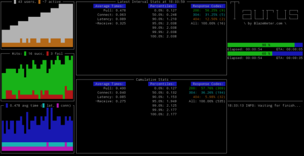

# Reporting & Results Processing

Reporting functionality in Taurus is delegated to special modules category. There is special [internal facility](#results-reading-and-aggregating-facility) that reads results from [executors](ExecutionSettings.md), aggregates them and feeds to configured reporters. Reporters are specified as list under top-level config key `reporting`, by default it is configured with two reporters:

```yaml
---
reporting:
    - final_stats
    - console
```

The example above uses a shorthand form for specifying reporters. Full form is using dictionaries and allows specifying some additional settings for reporters:

```yaml
---
reporting:
    - module: final_stats
    - module: console
```

Possible reporting modules are listed below.

## Post-Test Summary

This is the simplest reporter that just prints few basic KPIs in the console log after test execution, for example:

```
18:04:24 INFO: Samples count: 367, 8.17% failures
18:04:24 INFO: Average times: total 0.385, latency 0.115, connect 0.000
18:04:24 INFO: Percentile   0.0%: 0.125
18:04:24 INFO: Percentile  50.0%: 0.130
18:04:24 INFO: Percentile  90.0%: 1.168
18:04:24 INFO: Percentile  95.0%: 1.946
18:04:24 INFO: Percentile  99.0%: 2.131
18:04:24 INFO: Percentile  99.9%: 3.641
18:04:24 INFO: Percentile 100.0%: 3.641
```

This reporter is enabled by default. To enable it manually, use following config, some additional options are available:

```yaml
---
reporting:
  - module: final_stats
      summary: true  # overall samples count and percent of failures
      percentiles: true  # display average times and percentiles
      failed-labels: false  # provides list of sample labels with failures
      test-duration: true  # provides test duration 
```


## Console Screen

This reporter shows fullscreen dashboard with some KPIs and even ASCII-art graphs like this:



This reporter is enabled by default. To enable it manually, use following config:

```yaml
---
reporting:
    - console
```

There is module settings for Console Screen, containing option `disable`. It allows easy disabling fullscreen display by using [command-line](CommandLine.md) switch `-o`:

```bash
bzt config.yml -o modules.console.disable=true
```

On Windows, Console Screen is shown in separate window and users may change font size by holding Ctrl key and using mouse wheel.
Two additional options are `dummy-cols` and `dummy-rows`, they affect the size of _dummy_ screen that is used for non-tty output.

## Pass/Fail Criteria

Every execution has pass/fail status and there is a way to set this status based on runtime criteria. Special `fail-criteria` reporter offers this functionality. Another useful feature of pass/fail criteria is _auto-stop_ functionality, allowing to interrupt failed tests automatically, sparing the time and resources.

Pass/fail criteria are specified as array of `criteria`, set through `reporting` item in config:

```yaml
---
reporting:
 - module: fail-criteria
   criterias:
   - avg-rt of Sample Label>150ms for 10s, stop as failed
   - fail of Sample Label>50% for 10s, stop as failed
```

The above example use short form for criteria, its general format is `subject of label{condition}threshold {logic} timeframe, action as status`, where:

  - `subject` is the KPI that will be compared, listed below
  - `label` is sample label, empty for overall
  - `{condition}` is the comparison operator, one of `>`, `<`, `>=`, `<=`, `=`, `==` (same as `=`)
  - `threshold` is the value to compare with, some KPIs allows percentage thresholds
  - `{logic}` is the way value aggregated withing timeframe, `for` means taking latest value, `within` means aggregating as average or sum (depends on criteria nature)
  - `timeframe` is number of seconds the comparison must be valid, if `timeframe` is omitted, then the cumulative value for whole test will be used for comparison.
  - `action` is one of `stop` or `continue`, default is `stop`, if you have chosen to continue, the fail status will be applied at the end of the test execution
  - `status` is one of `failed` (default) or `non-failed`

Any non-required parameters might be omitted, the minimal form is `subject{condition}threshold`. 

Possible subjects are:

 - `avg-rt` - average response time, e.g. `avg-rt>2s500ms`
 - `avg-lt`- average latency, e.g. `avg-lt for mylabel>2`
 - `avg-ct` - average connect time, e.g. `avg-ct>100ms`
 - `stdev-rt` - standard deviation for full response time, e.g. `stdev-rt>0.5`
 - `p...` - percentile timing, e.g. `p90>1s for 10s`, `p99.9>10s, stop as failed`
 - `hits` - number of responses, e.g. `hits for my-label>100 for 5s, stop as non-failed`
 - `succ` or `success` - successful responses, supports percentage threshold, e.g. `succ\<100%` 
 - `fail` or `failures` - failed responses, supports percentage threshold, e.g. `failures>50% for 5s, stop as failed`
 - `rc...` - response codes criteria, supports percentage threshold, response code may be specified using wildcards `?` and `\*`, e.g. `rc500>20 for 5s, stop as failed`, `rc4??>20%`, `rc\*>=10 for 1m`, `rcException>99% for 1m, continue as failed`, 


The full form of the criteria is conducted by Taurus automatically from short form. You can also specify it as this:

```yaml
---
reporting:
 - module: fail-criteria
  criterias:
  - subject: avg-rt  # required
    label: 'Sample Label'  # optional, default is ''
    condition: '>'  # required
    threshold: 150ms  # required
    timeframe: 10s  # optional, default is none
    logic: for  # optional, logic to aggregate values within timeframe. 
                # Default 'for' means take latest, 
                # 'within' means take sum/avg of all values within interval
    fail: true  # optional, default is true
    stop: true  # optional, default is true
```

### Custom Messages for Criteria

By default, Taurus uses criteria string to present it in messages. If you want to change the message, you can do one of:
 - set `message` field for full form of criteria
 - set message by prepending it to criteria string, like this: `My message: avg-rt>10s`
 - use dictionary instead of array to specify message and criteria, like this:
 
```yaml
---
reporting:
 - module: fail-criteria
   criterias:
     My Message: avg-rt of Sample Label>150ms for 10s, stop as failed
     Sample Label fails too much: fail of Sample Label>50% for 10s, stop as failed
```


## BlazeMeter.com Reporting Service

Like it always happens with tools that focused on _executing_ tests, they are unable to provide sufficient reporting functionality. As professional user, you need some centralized storage to be able to access test results in convenient and interactive way, compare different executions, see trends over time and collaborate with your colleagues. [BlazeMeter.com](http://blazemeter.com) offers such service, it has both commercial and free of charge versions. 


### Anonymous Usage

The simplest way to get a taste of BlazeMeter reporting is to use `-report` command-line switch. This will enable result feeding to service without any other settings required. You will receive the link for your report in the console text, and the link will be automatically opened in your default browser, see `browser-open` option for more tuning.

The official policy for BlazeMeter reports uploaded from Taurus, is that anonymous reports are kept for 7 days and if you're using your own account, then reports are kept according to the retention policy of your account. For details see BlazeMeter service [website](https://blazemeter.com/). 

### Personalized Usage

If you want the results to be stored in your existing BlazeMeter account, you'll need to specify the reporting settings in your configuration file.Get the API token from BlazeMeter.com (find it under your [Settings => API Key](https://a.blazemeter.com/app/#settings/api-key)) and put it into `token` option:

```yaml
---
modules:
  blazemeter:
    token: TDknBxu0hmVnJ7NqtG2F
```

It is highly recommended to place the token setting in your personal [per-user config](CommandLine.md#configuration-files-processing) `~/.bzt-rc` to prevent it from being logged and collected in artifacts.

Now you can use `-report` command-line switch, or you can set BlazeMeter reporting as part of your config, the `test` option specifies test name to use, `project` names group of tests:

```yaml
---
reporting:
  - module: blazemeter
    test: Taurus Demo
    project: Taurus Tests Group
```

Advanced settings:

```yaml
---
modules:
  blazemeter:
    address: https://a.blazemeter.com  # reporting service address
    data-address: https://data.blazemeter.com  # data service address
    browser-open: start  # auto-open the report in browser, 
                         # can be "start", "end", "both", "none"
    send-interval: 30s   # send data each n-th second
    timeout: 5  # connect and request timeout for BlazeMeter API
```


## JUnit XML Reporter

This reporter provides test results in JUnit xml format parsable by Jenkins [JUnit Plugin](https://wiki.jenkins-ci.org/display/JENKINS/JUnit+Plugin).
Reporter has two options:
- `filename` (full path to report file, optional. By default `xunit.xml` in artifacts dir)
- `data-source` (which data source to use: `sample-labels` or `pass-fail`)

If `sample-labels` used as source data, report will contain urls with test errors.
If `pass-fail` used as source data, report will contain Pass/Fail criterias information.

Sample configuration:

```yaml
---
reporting:
  - module: junit-xml
    filename: /path_to_file/file.xml
    data-source: pass-fail
```


## Results Reading and Aggregating Facility

Aggregating facility module is set through general settings, by default it is: 

```yaml
---
settings:
  aggregator: consolidator
```

The `consolidator` has several settings:

```yaml
---
modules:
  consolidator:
    generalize-labels: true  # replace digits and UUID sequences 
                             # with N and U to decrease label count
    ignore-labels: # sample labels from this list 
                   # will be ignored by results reader
      - ignore
    buffer-seconds: 2  # this buffer is used to wait 
                       # for complete data within a second
    percentiles:  # percentile levels to track, 
                  # 0 also means min, 100 also means max 
    - 0.0
    - 50.0
    - 90.0
    - 95.0
    - 99.0
    - 99.9
    - 100.0
```

Note that increasing `buffer-seconds` might sometimes make results aggregation more robust, by price of delaying analysis.

